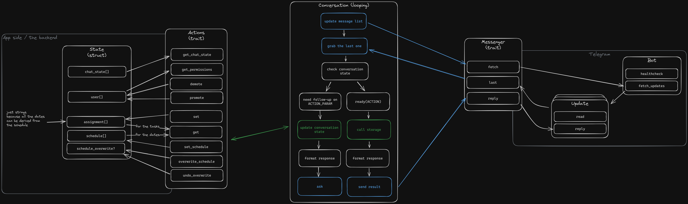
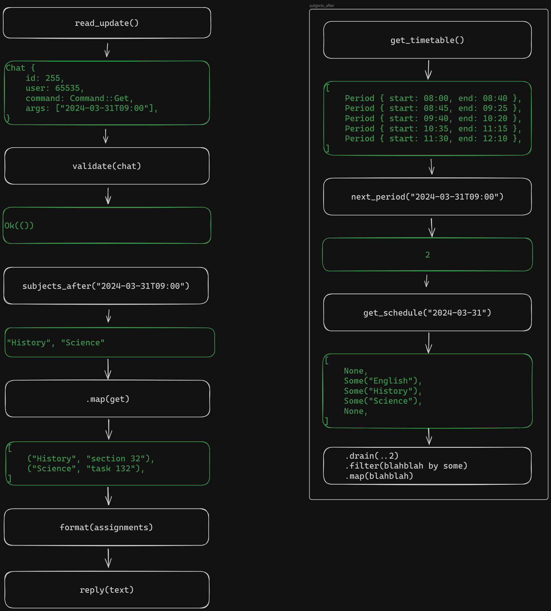

> A homework assignment keeping telegram bot

Our class in high school has a problem with assignments. Teachers would constantly forget to put them into the system they were supposed to use and tell us to remember the assignments instead. No-one did, so they kept asking me. I grew tired of that, so I made this:

\<a video clip showing how it works />

Features:
- setting/getting assignments
- changing the schedule for tomorrow (happened a lot of times and was not supported by the system the school used)
- notifications when an admin added an assignment

## Progress
- [x] define the task
- [x] define types
- [x] create repo [[@pc]]
- [x] figure out how to use rust under NixOS
- [x] create README
- [x] create types [[@pc]]
- [x] create incoming message handling
- [x] create conversation state [[@pc]]
- [x] define the telegram module [[@phone]]
- [x] move telegram things into a separate module
- [x] figure out how to actually fix the problem described below
- [x] redo the types
- [x] write the state module, make it work in-ram [[@pc]]
- [x] write the telegram module [[@pc]]
- [ ] implement the flow described below [[@pc]]
- [ ] fix everything that is broken because of the restructuring [[@pc]]
- [ ] add logging [[@pc]]
- [ ] implement persistent storage [[@pc]]
- [ ] initial launch [[@pc]]
- [ ] improve error types [[@pc]]
- [ ] wrap builds in a flake [[@pc]]
- [ ] use references instead of cloning everything (part of why I'm doing this project is to learn that) [[@pc]]
- [ ] add documentation [[@pc]]
- [ ] research how to store files [[@phone]]
- [ ] add file uploads [[@pc]]

## Server owner's manual (self-hosting)
The server is made as simple as possible, it's only capable of managing data for a single class. If you need to scale it to multiple, deploy multiple instances.

\<binary installation instructions here />

## Building from source
You'll need any machine that has the Nix package manager on it.

\<instructions on how to use it with nix here />

## Admin's manual
All the commands don't take any arguments and ask follow-up questions if needed

### Managing admins
- `/promote` then asks for you to send a contact. You can do that by going to that person's profile, tapping three dots in the top right and `share contact`.
- `/demote`

### Managing assignments
- `/set` gives you the list of subjects and an option to use the one that's currently in progress according to the bot's schedule, then asks for the assignment
- `/delete` presents you with a list of subjects

> [!NOTE] If an assignment for a certain subject is not changed, it's passed on to a future date

### Managing schedules
- `/update-tomorrow-schedule`, that's really meant for the teachers. It asks for a new list of subjects, you have to type their names manually.

## A peek under the hood
The app is designed to be as simple as possible, so it does not fully adhere to 12 factor app principles. They recommend storing persistent data in a database, but that would be quite overkill for my purposes. 12 factor apps are designed to scale, here you just host your own instance for each class.

I'm temporarily ditching async because I can't figure out how to work… Get back to that later.



Modules:
- state
- telegram

## Stream of consciousness
My biggest problem right now is that I don't really understand how a conversation would work. So I'll think it through:

What can the user send?
- A contact, to change their role
- a text message, which is probably the assignment
- a time, time and text all of that is a period.

What types do I have in the app?
- A user with a fixed set of permissions
- an assignment to a subject, dates are calculated based on
- the schedule, which is itself a vector of
- periods.

The main thing app's users are gonna be doing is getting and setting assignments, the rest is admin/maintenance.

### Assignment manipulation
The set action is relatively simple:
```text
user: /set sci
bot:  what's the assignment?
user: section 8
bot:  saved
```

The case for the subjects... I'm going to ignore it and set everything as lowercase.

This also brings up an interesting issue: what to do if the user asks to `set` an assignment for a nonexistent subject? Initially I thought that the subject should be created on the fly, but thinking about it...
The subjects are in the schedule. So it should instead search the schedule, try to find the subject. If it succeeds, it should create the assignment, otherwise grab a closest match by name and ask the user if that's what they meant.

The clear feature is going away, the assignment is always present. When it's not, it's getting rescheduled from the last lesson and that should be handled automatically.


Now about getting them, that's more fun:
```text
user: /get
bot: due tomorrow:
bot: english: section 16's grammar
bot: history: section 32
bot: science: task 128
bot: (button saying "next day")
```

But if they ask it in the middle of 2nd pair, it should respond with:
```text
user: /get
bot: due today
bot: history: section 32
bot: science: task 128
```



### Schedules
I don't really know, plus they are fixed (apart from the overwrite). I'll read them from file for now and figure out the conversation later. Probably the bot should ask first though.